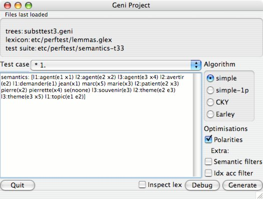
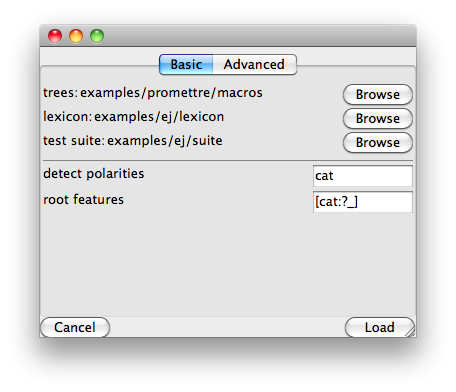
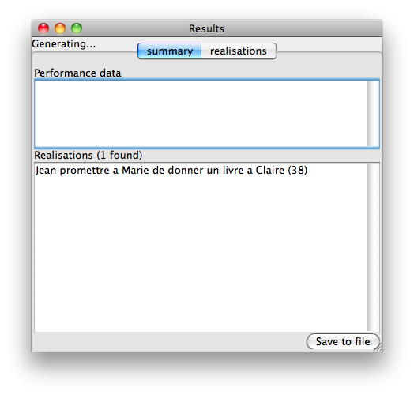
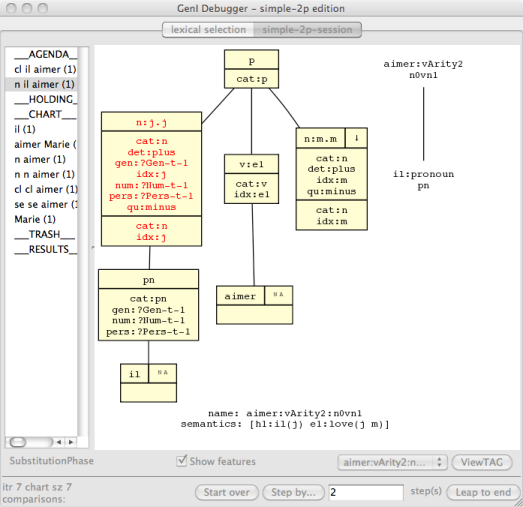

## Input screen

When you first start GenI, you will see the input screen.  It
allows you to type in an input semantics (or to modify the one that was
automatically loaded up), select some optimisations and run the
realiser.  You can also opt to run the [debugger](#debugger) instead of
the realiser.

## Configuration

The configuration GUI aims to a provide a graphical substitute for the
command line switches.  Note you cannot yet select optimisations and test
cases from this window; use the main window instead. Note also that
changes to GenI tend to start from the command line switches and only
percolate to the GUI when time permits. For full control of GenI, see
`geni --help`.

> 

## Generation

When surface realisation is complete, we display a results window with
various tabs for intermediary results in lexical selection, derived
trees, derivation trees and generation statistics.

> 

The results window (above) shows all of the sentences found.
Each sentence is annotated with its chart item number.  You can
inspect the derived and derivation tree for that result by selecting
the realisations tab.

## Debugging

Instead of going directly to the results window, you
could instead use the interactive debugger which GenI provides. The
debugger shows a separate tab for each phase in surface realisation
(lexical selection, filtering, building).

> 

### Stepping through the debugger

The interactive debugger can have a diffrent GUI for each realisation
algorithm. Here we will discuss the interface for the Simple 2-Phase
algorithm which uses by default. The interfaces for other algorithms are
likely to very similar.

> 

The debugger allows you to step through chart generation. Using the
’Step by’ button, you can walk through an arbitrary number of steps,
where each step consists in pulling one item of the agenda, combining it
with the chart and putting some of the results back on to the agenda (or
the trash, or results pile as the case may be). New chart items produced
on each step typically have one of their nodes highlighted in red. This
indicates that the node was the site of the most recent “event”. For
example in the substitution phase, the red node indicates where the
substitution operation was performed; whereas in the adjunction phase,
it could either indicate where adjunction was performed or where a
null-adjunction constraint was applied.

If you select the “show features” checkbox, all nodes in the chart item
will be expanded to reveal the underlying feature structures. The
components of this expanded representation are segmented into the
following boxes:

> 

1.  Summary: here, `n:j.m` indicates that the category is `n`, that
    the top `idx` feature is associated with `j` and the bottom one
    with `m`.

2.  Decorations: here, $\downarrow$ indicates that this is a TAG
    substitution node, following the usual conventions in the
    literature.

3.  The top feature structure

4.  The bottom feature structure
